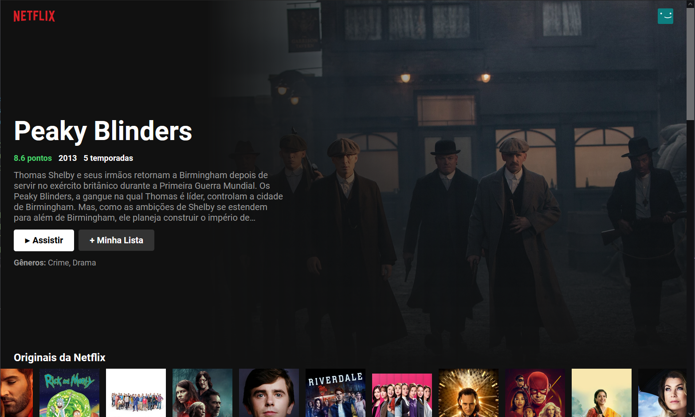
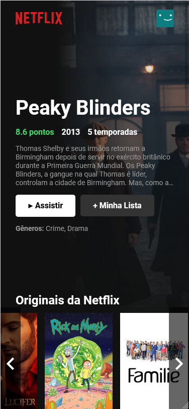

## 🚀 Prints da aplicação

### 🔐 Tela inicial

 

### 📝 Tela inicial no smartfone

 

## 🚀 Tecnologias

Esse projeto foi desenvolvido com as seguintes tecnologias/libs:

- ReactJS
- Meterial UI Icons
- API do [themoviedb.org](https://www.themoviedb.org/documentation/api)

## 💻 Projeto

Esse é um site meramente para aprendizado e portifólio, **não tem ligação com a empresa Netflix e não visa ser uma cópia do site da mesma**. Feito com ReactJS para treinamento de boas práticas com o código, consumo de API e criação de componentes que o próprio React disponibiliza para nós.

## 🔖 Layout

Você pode visualizar o layout do projeto inteiro através [desse link](https://netflix-clone-douglas.vercel.app/).
